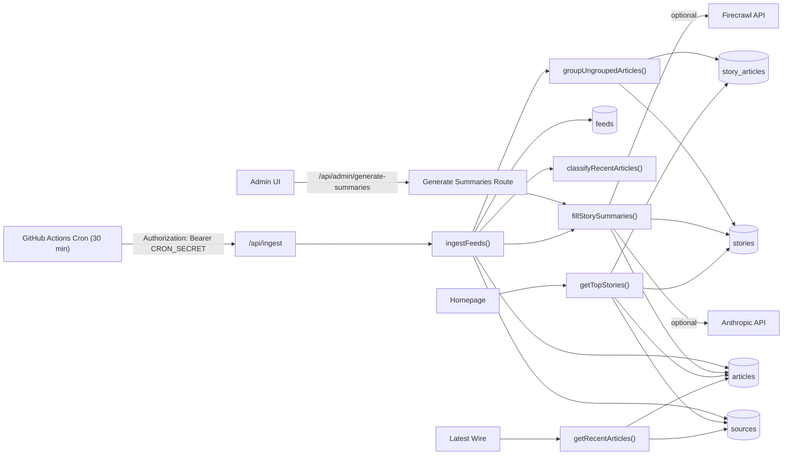

# Architecture (Current)

## Runtime Topology
- Single runtime today: `apps/web` (Next.js app + API routes + ingest logic).
- Persistent store: Postgres (Supabase).
- Optional external services:
- Anthropic: summary adjudication and bounded LLM rewrite.
- Firecrawl: full-text extraction when RSS summaries are weak.
- Scheduler: GitHub Actions (`.github/workflows/ingest-cron.yml`) calls `GET /api/ingest`.

## Data Flow

## Request Flows
- Automated ingest:
- Scheduler calls `GET /api/ingest` with Bearer token.
- Route validates `CRON_SECRET` or `INGEST_SECRET`.
- `ingestFeeds()` returns JSON stats for fetch, quality, grouping, and summaries.
- Manual ingest/debug:
- `POST /api/ingest` with `x-ingest-secret`.
- Manual summary recovery:
- Admin trigger calls `fillStorySummaries()` for top stories only.

## Pipeline Stages
1. Feed fetch + normalization
- Load active `feeds`.
- Parse RSS or scrape feed pages for links.
- Canonicalize URLs, resolve Google News redirects, derive/ensure `sources`.

2. Article quality gate
- Write/update `articles`.
- Classify `quality_label`: `article | uncertain | non_article`.
- Filter non-article/profile/about/author/careers paths.

3. Story grouping
- Group unlinked articles by lexical `story_key` (title-token method).
- Link through `story_articles`.
- Update `stories.last_seen_at`.

4. Summary fill + preview contract
- Build summary candidates (`existing`, `rss`, `scrape`, optional `llm`, `fallback`).
- Choose winner by AI adjudication (if available) or deterministic scoring.
- Write:
- `articles.summary_choice_*` for diagnostics.
- `stories.summary` for story brief.
- `stories.preview_*` contract for UI.
- Suppress synthetic/fallback-style text from homepage display.

## Ranking and Lead Selection (Current)
- Implemented in `apps/web/src/lib/ranking.ts` and applied by `getTopStories()`.
- Inputs:
- impact, urgency, policy hits, novelty, relevance.
- article volume, source diversity, recency decay.
- source authority multiplier (`avg_weight` amplified nonlinearly).
- Penalties:
- evergreen/instructional demotion.
- low-authority singleton demotion.
- hard-news gate demotion for low-newsworthiness feature clusters.
- Output includes:
- `storyType`, `leadEligible`, `leadReason`, `urgencyOverride`.
- detailed score breakdown used by QA script.
- Lead slot policy:
- if top story is not eligible and another eligible story exists, eligible story is promoted to lead.
- pinned stories still override.

## Read/Render Contracts
- Homepage uses `getTopStories()`:
- ranked stories with filtered preview text and lead metadata.
- Latest Wire uses `getRecentArticles()`:
- stricter link/title hygiene to avoid section/meta links.
- Story detail page reads `stories` + linked `articles`.

## Data Model (Primary Tables)
- `sources`: domain, tier, weight.
- `feeds`: source link, type (`rss` or `scrape`), health fields.
- `articles`: canonical URL, content fields, quality fields, summary-choice diagnostics.
- `stories`: cluster-level headline/summary + preview contract + status.
- `story_articles`: many-to-many article linkage and primary flag.
- `admin_events`: admin action trail.

## Operations
- Scheduler source of truth: GitHub Actions cron.
- Local QA:
- `npm run dev:web`
- `npm run qa:summaries`
- QA output includes:
- ingest stats
- preview quality metrics
- lead selection diagnostics + score breakdown.

## Known Limits
- Grouping is lexical (`story_key`) and can still miscluster edge cases.
- Ranking is deterministic; no AI top-N reranker yet.
- Worker orchestration (`apps/worker`) is not yet the runtime execution path.
- No fixture-based regression suite yet for clustering/summary/ranking classes.
